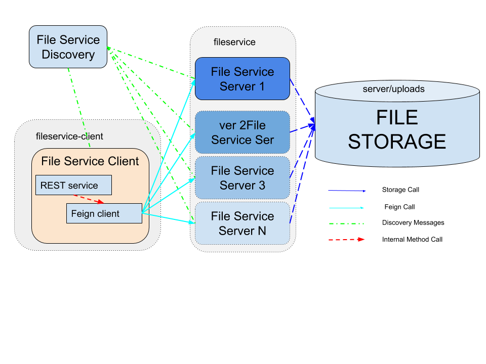

# fileservice

[](https://circleci.com/gh/rslvn/fileservice)
[](https://travis-ci.com/rslvn/fileservice)
[](https://coveralls.io/github/rslvn/fileservice?branch=master)

## microservices

File Service Overview:



### discovery server
[http://localhost:8761/](http://localhost:8761/)

## docker

### manage images and containers
```
docker-compose build
docker-compose down
docker-compose up -d
```

### scale server container
```
docker-compose scale server=3
```

### container IPs
```
docker network inspect fileservice_default
```

or

```
docker exec -it fileservicediscovery ifconfig

docker exec -it fileservice_server_1 ifconfig
docker exec -it fileservice_server_2 ifconfig
docker exec -it fileservice_server_3 ifconfig

docker exec -it fileservice_client_1 ifconfig
```

### docker logs
```
docker-compose logs -f
```
or 

```
~$ docker exec -it fileservicediscovery /bin/sh
#tail -f logs/application.log 


~$ docker exec -it fileservice_server_1 /bin/sh
#tail -f logs/application.log 

~$ docker exec -it fileservice_server_2 /bin/sh
#tail -f logs/application.log 

~$ docker exec -it fileservice_server_3 /bin/sh
#tail -f logs/application.log 


~$ docker exec -it fileservice_client_1 /bin/sh
#tail -f logs/application.log 

```

## server

-upload a file
```
curl -i -X POST -H "Content-Type: multipart/form-data" \
        -F "file=@test.out;filename=test.out" \
        http://172.21.0.3:8080/api/v1/files/upload
```

-upload a file with folder structure
```
curl -i -X POST -H "Content-Type: multipart/form-data" \
        -F "file=@test/test.out;filename=test/test.out" \
        http://172.21.0.3:8080/api/v1/files/upload
```

-download a file
```
curl -i -X GET \
        http://172.21.0.3:8080/api/v1/files/download/test.out
```

-list files
```
# folder
curl -i -X GET -H "Content-Type: application/json" \
            "http://172.21.0.3:8080/api/v1/files/test"
# file            
curl -i -X GET -H "Content-Type: application/json" \
            "http://172.21.0.3:8080/api/v1/files/test.out"
```

-delete file or folder
```
# file
curl -i -X DELETE \
        http://172.21.0.3:8080/api/v1/files/test.out/false
```


## client

-upload a file
```
curl -i -X POST -H "Content-Type: multipart/form-data" \
        -F "file=@test.out;filename=test.out" \
        http://172.21.0.4:8090/api/v1/files/client/upload
```

-upload a file with folder structure
```
curl -i -X POST -H "Content-Type: multipart/form-data" \
        -F "file=@test/test.out;filename=test/test.out" \
        http://172.21.0.4:8090/api/v1/files/client/upload
```

-download a file
```
curl -i -X GET \
        http://172.21.0.4:8090/api/v1/files/client/download/test.out
```

-list files
```
# folder
curl -i -X GET -H "Content-Type: application/json" \
            "http://172.21.0.4:8090/api/v1/files/client/test"
# file            
curl -i -X GET -H "Content-Type: application/json" \
            "http://172.21.0.4:8090/api/v1/files/client/test.out"
```

-delete file or folder
```
# file
curl -i -X DELETE \
        http://172.21.0.4:8090/api/v1/files/client/test.out/false

#folder recursive
curl -i -X DELETE \
        http://172.21.0.4:8090/api/v1/files/client/test/true
        
#folder not recursive
curl -i -X DELETE \
        http://172.21.0.3:8080/api/v1/files/files/test/false

```